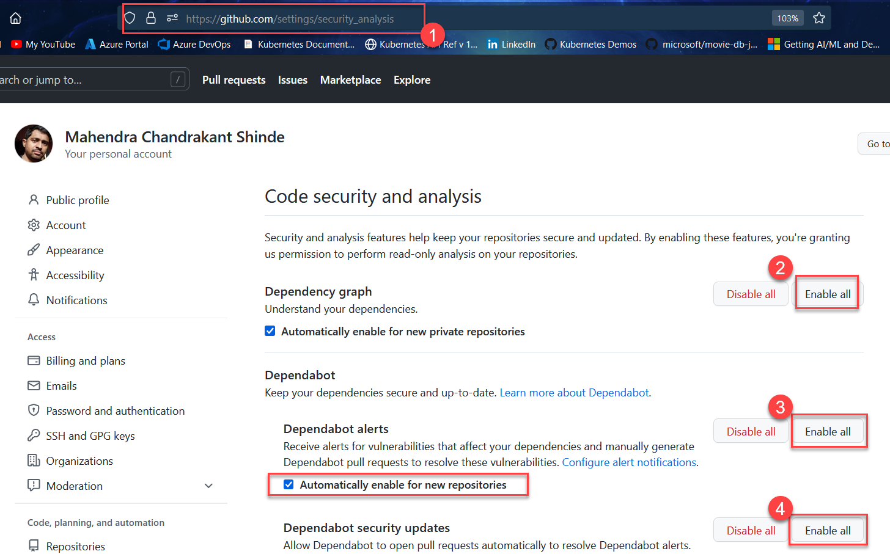
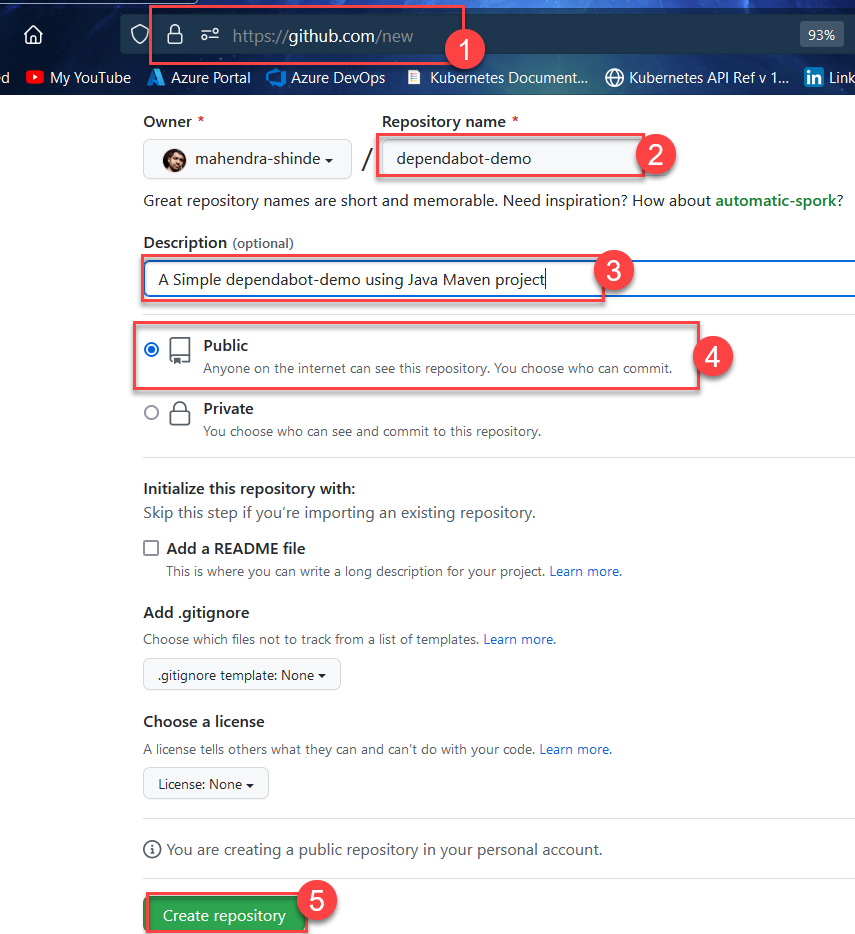
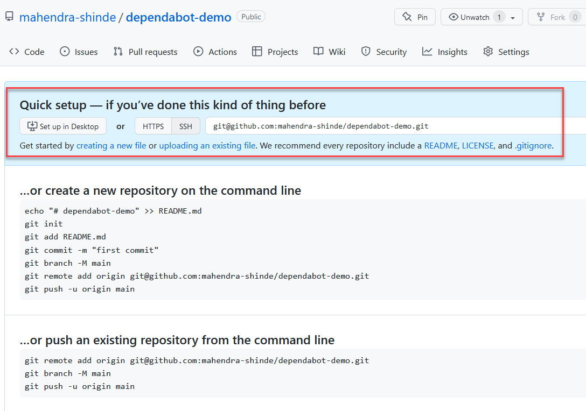
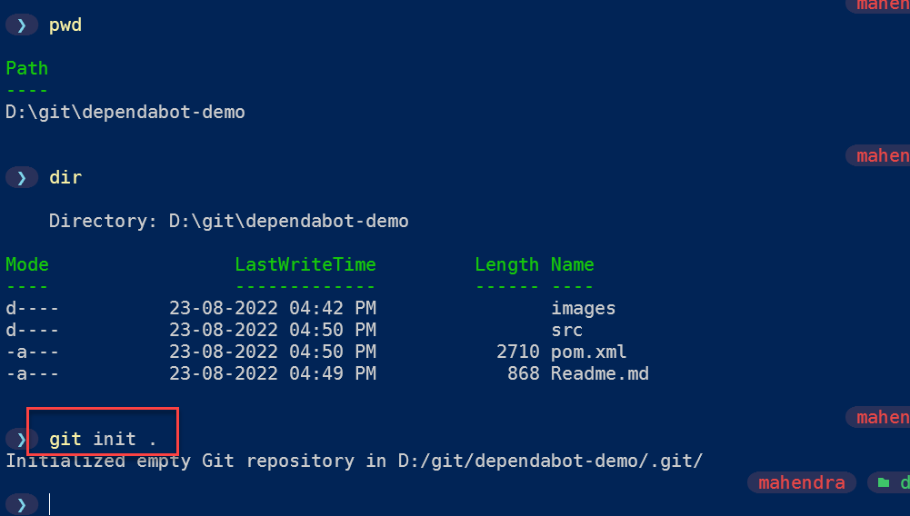

# Dependabot Alerts in GitHub

* Setup / Enable Dependabot Alerts for Organization

	1. Login to https://github.com 

	2. Visit https://github.com/settings/security_analysis to update `Code Security and Analysis` settings for your github organization.

		

	3. After your enable `dependabots` for all repositories, lets create a new remote repository on github.

		You need to visit `https://github.com/new` to create your new `bare` repository.
	
		

	4. You should get `Quick setup` guide for the empty repository. It should look like this:

		

	5. Now, either create new maven project or use existing maven project in your local filesystem. Initialize your maven project directory as new git repository.

		```
		git init . 
		````	

		

	6. Now, you need to commit the changes (new/old maven project)		

		```

		```

